 
## 查看主页获取源码

> **作者介绍**： **✌**全网粉丝10W+本平台特邀作者、博客专家、CSDN新星计划导师、java领域优质创作者,博客之星、掘金/华为云/阿里云/InfoQ等平台优质作者、专注于项目实战 **✌**

  

### 一、作品包含

源码+数据库+设计文档万字+PPT+全套环境和工具资源+部署教程

### 二、项目技术

前端技术：Html、Css、Js、Vue、Element-ui

数据库：MySQL

后端技术：Java、Spring Boot、MyBatis

  

### 三、运行环境

开发工具：IDEA/eclipse + 微信开发者工具

数据库：MySQL5.7

数据库管理工具：Navicat10以上版本

环境配置软件： JDK1.8+Maven3.6.3

前端Nodejs：14

### 四、项目介绍
项目编号：mpweixinA027

高校心理咨询微信小程序是一款面向在校大学生提供心理健康服务的便捷平台。它旨在为学生提供一个私密、专业的心理咨询空间，帮助解决学习压力、人际关系、情绪管理等方面的问题。通过这款小程序，学生可以随时预约专业的心理咨询师，进行一对一的在线咨询，也可以通过心理测试、文章阅读等方式自我调节和成长。小程序的设计充分考虑了学生的隐私保护，为高校学子提供了一个安全、可靠的心理健康支持系统。

前台用户功能：浏览首页、心理老师、心理知识、心理测试、个人中心。

后台分为管理员和心理老师
管理员的功能：首页、个人中心、心理老师管理、学生管理、心理知识管理、心理咨询管理、在线预约管理、心理评估管理、心理提示管理、心理档案管理、试卷管理、试题管理、系统管理。
心理老师的功能：首页、个人中心、心理老师管理、心理知识管理、心理咨询管理、在线预约管理、心理评估管理、心理提示管理、心理提示管理、试卷管理、试题管理。

### 五、运行截图

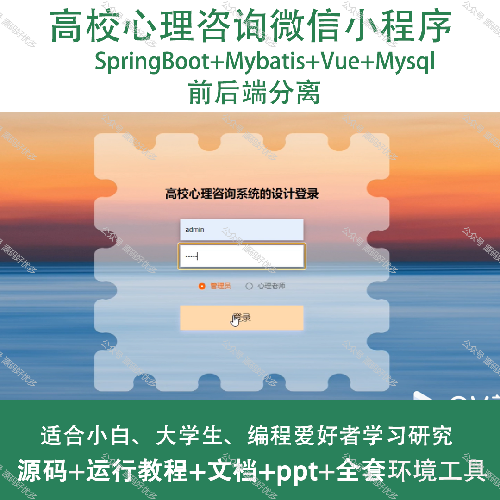
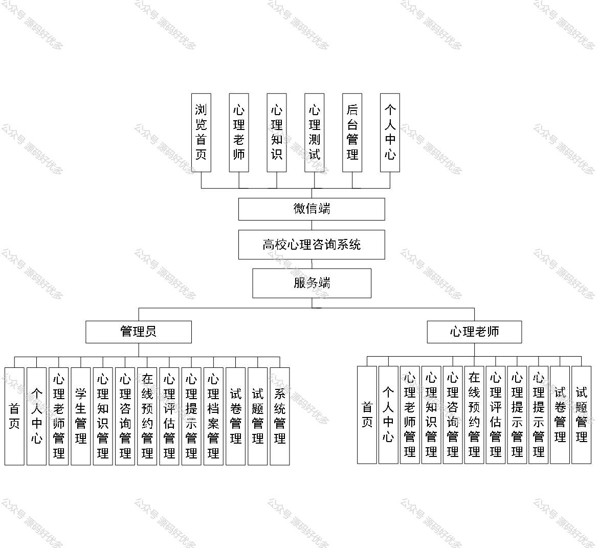
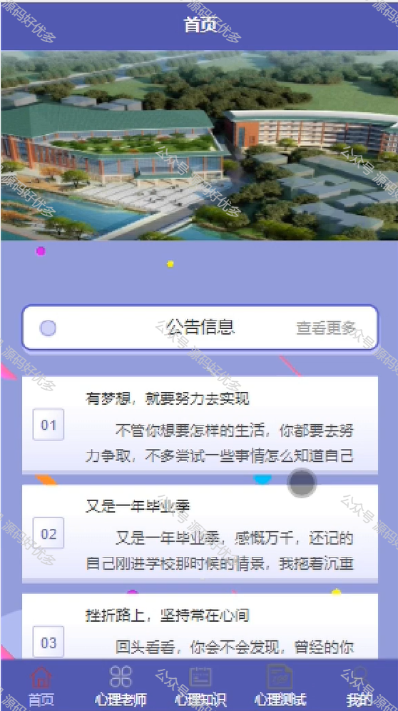
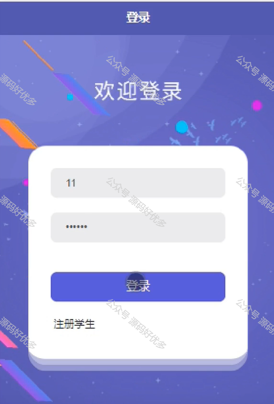
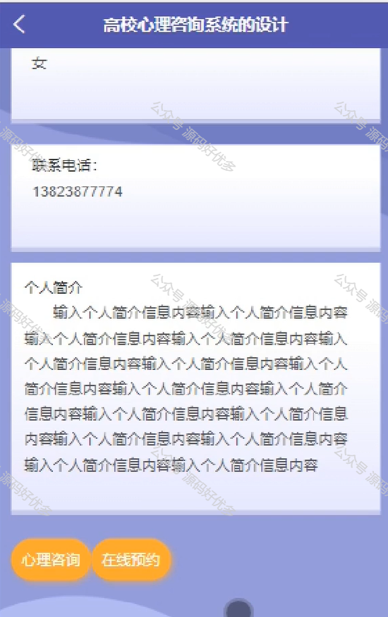
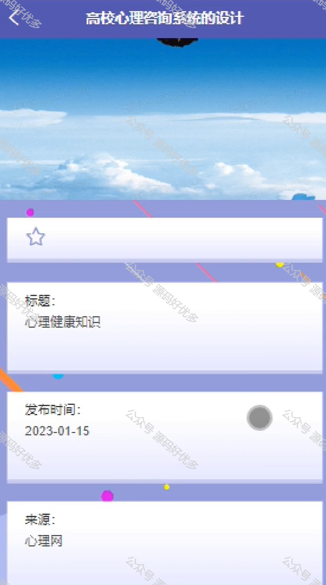
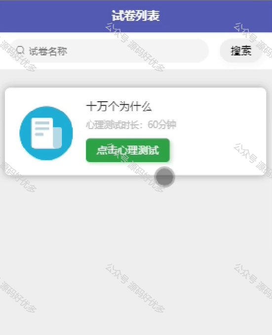
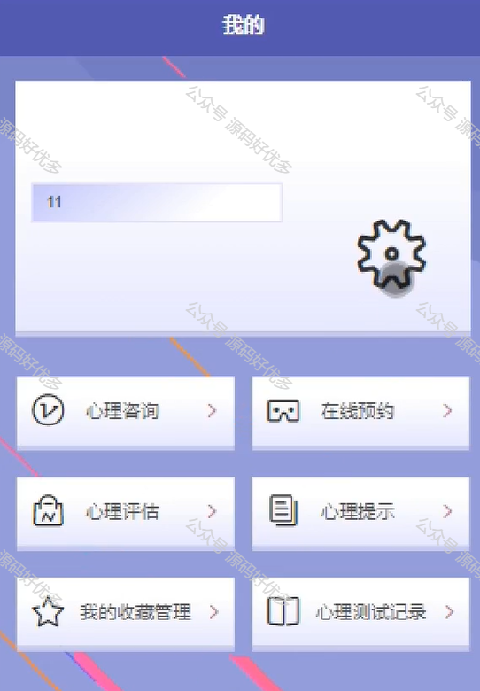
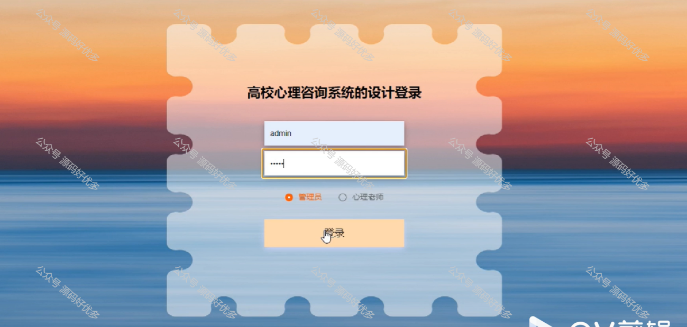
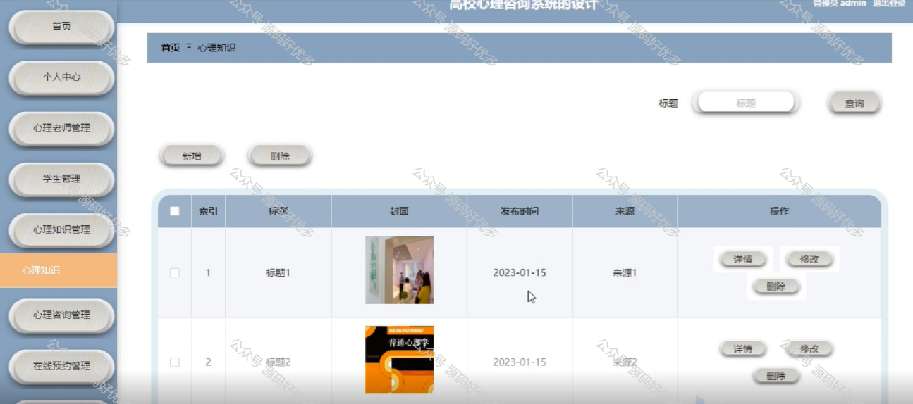
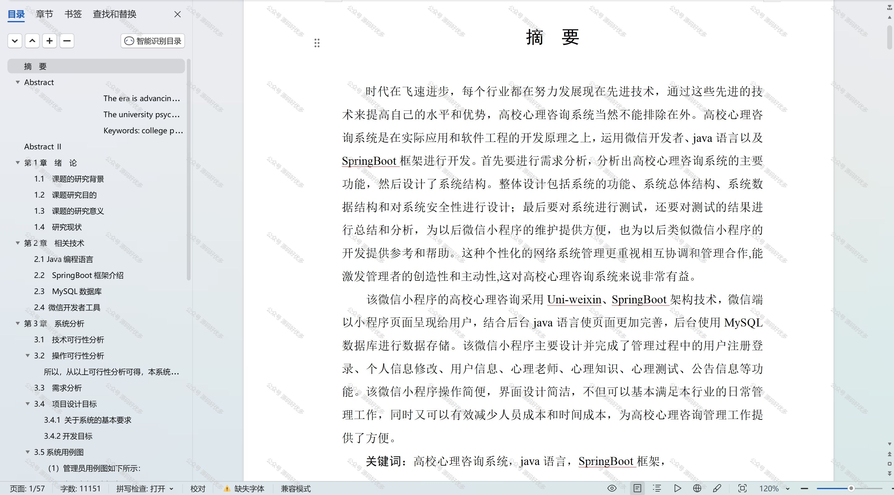

  
